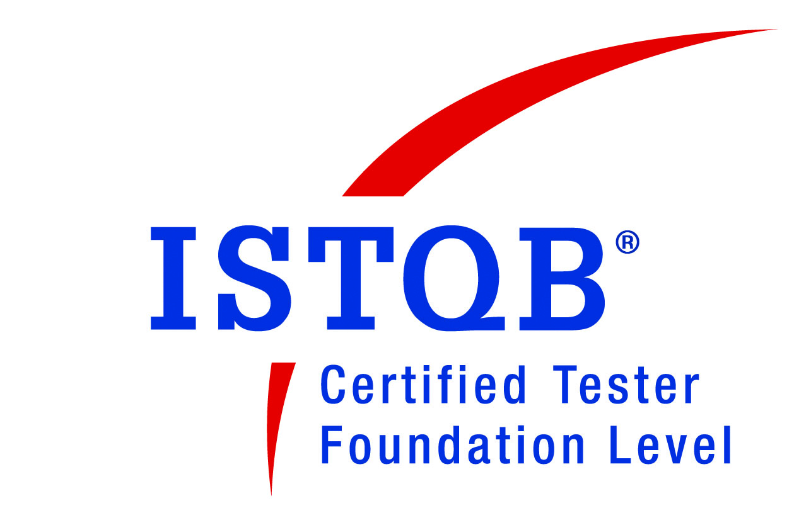

  

  

  
  

## About Me 

Crafting Quality, Crushing Bugs – because every line of code deserves flawless performance.

#### Educational Background 👨‍💻

Holding a bachelors degree in Computer Science from National University of Computer and Emerging Sciences.

#### Core Skills 🌟

* Programming Languages: C, C++, Python, JavaScript, Java, Kotlin
* Testing: Manual and Automation Testing
* Automation Tools: Postman, Cypress, JMeter, Selenium, Appium
* Certification: ISTQB Foundation Level Certified

#### Experience Snapshot 🧩

* Manual Testing for websites and applications, ensuring every detail meets high-quality standards.
* Automation Testing with hands-on experience in tools that streamline and strengthen testing processes.
* Agile Methodologies: Proficient in Scrum and Kanban, delivering iterative, high-quality releases.
* SDLC Knowledge: Skilled in Waterfall, V-Model, and Agile models for diverse project needs.

#### Avid Writer & Active Contributor ✍️

I’m an active contributor on Medium, sharing insights on software testing, best practices, and the evolving role of QA engineers in development. Additionally, I regularly answer questions on Quora across various topics, sharing my knowledge and offering real-world problem-solving advice to help others in diverse fields.

#### What Drives Me ⚡

Delivering reliable, efficient software solutions through a combination of development and QA skills, keeping up with latest technologies to bring adaptability and efficiency to every project I work on.

## 🛠️ Languages & Tools

  

    &nbsp;
    &nbsp;
    &nbsp;
    &nbsp;
    &nbsp;
    &nbsp;
    &nbsp;
    &nbsp;
    &nbsp;
    &nbsp;
    &nbsp;
    &nbsp;
    &nbsp;
    &nbsp;
    &nbsp;
    &nbsp;
    &nbsp;
    &nbsp;
    &nbsp;
    &nbsp;
    &nbsp;
    &nbsp;
    &nbsp;
    &nbsp;
    &nbsp;
    &nbsp;
    &nbsp;
    &nbsp;
    &nbsp;
    &nbsp;
    &nbsp;
    
    &nbsp;
    &nbsp;
    &nbsp;

 
## 🖥️ Skills

- **Project Management:**
  - Jira
  - Clickup
  - Notion
  - MarkUp
  - Microsoft Excel
  - Microsoft Word
  - Slack
  - Asana
  - Trello
  - Allure TestOps

- **Testing Techniques:**
  - **Static Testing**
      - Informal Code Review
      - Peer Review
      - Static code analysis
      - Document analysis
      - Requirement analysis
      - Design analysis
      - SRS and FRD analysis
      - Writing and analysing test cases and test plans
      - Writing and developing test strategies

   
  - **Dynamic Testing**
      - Component Testing
      - Component Integration Testing
      - Integration Testing
      - System Testing
      - System Integration Testing
      - Acceptance Testing
      - Regression Testing
      - Smoke Testing
      - Sanity Testing
      - Retesting Testing
      - Exploratory Testing
      - Ad-hoc Testing
      - Monkey Testing
      - Gorilla Testing
      - Boundary Value Testing
      - State Transitioning Testing
      - Equivalence Class Testing
      - Black/Grey/White box Testing
      - Compatibility Testing
      - Web Application Testing
      - Mobile Application Testing
      - Alpha/Beta Testing
      - Cross Browser Testing
      - UI Testing
      - User Acceptance Testing
      - Front-end Testing
      - E2E Testing
      - API Testing
      - Database Testing
      - Performance Testing
          - Load Testing
          - Stress Testing
          - Endurance Testing 

 - **Test Scripting Languages:**

   - JavaScript
   - Python
   - Java
   - TypeScript

 - **Tools and Frameworks:**
 
    - Cypress
    - Selenium
    - Postman
    - Proxyman
    - EsLint
    - Grafana K6
    - JMeter
    - JUnit
    - Pytest
    - Simulators
    - Emulators

## Star History 🌟

## 📲 Get in Touch

📬 Reach out to me via my email address hammadrashid2001@gmail.com

🔗 Follow me on [LinkedIn](https://www.linkedin.com/in/hammad-rashid-2b51501aa/) and we can have an interesting conversation 😃
